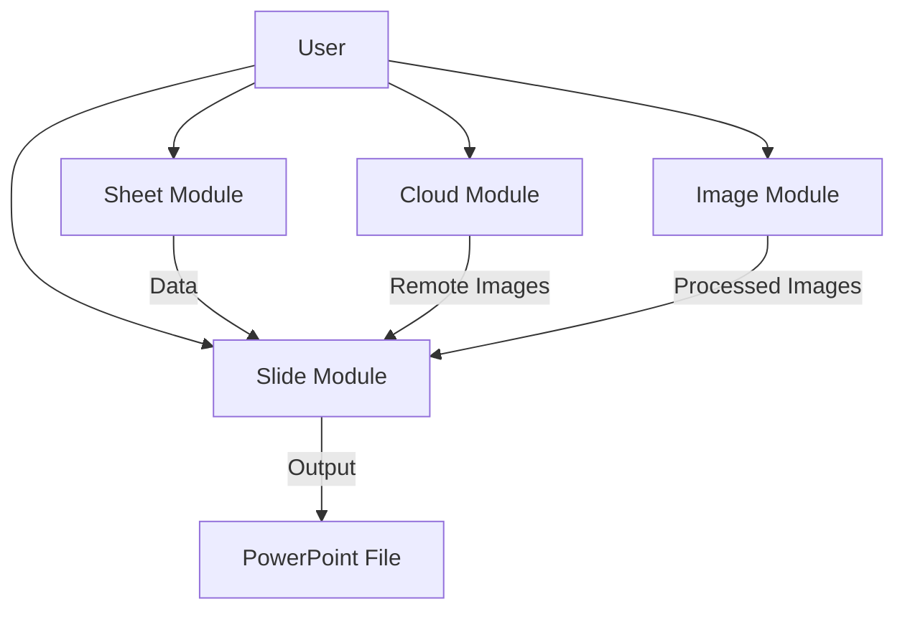

# Framework Overview

[🇻🇳 Vietnamese Version](../vi/overview.md)

## Purpose

`SlideGenerator.Framework` is a high-performance .NET library designed to abstract the complexities of generating PowerPoint presentations from structured data. It serves as the core processing engine for the SlideGenerator application, handling everything from parsing Excel files to intelligent image cropping and slide rendering.

While the Backend handles job orchestration and concurrency, this Framework provides the atomic tools to modify files.

## Architecture

The framework is organized into four independent but complementary modules:



## Modules

### 1. ☁️ Cloud (`SlideGenerator.Framework.Cloud`)
Handles the resolution of shareable links (Google Drive, OneDrive, Google Photos) into direct download streams. This allows the generator to pull images directly from cloud storage without manual downloading.

**Key Components:**
- `CloudUrlResolver`: Static utility for resolving cloud share links

**Documentation:** [Cloud Module Guide](cloud-module.md)

### 2. 📊 Sheet (`SlideGenerator.Framework.Sheet`)
A lightweight wrapper around `OpenXml` for reading data sources.
- **Workbook:** Represents the entire Excel file.
- **Worksheet:** Provides row-by-row access to data as generic dictionaries (`Dictionary<string, object>`).

**Key Components:**
- `Workbook`: Load and manage Excel files
- `Worksheet`: Access row data with type conversion

**Documentation:** [Sheet Module Guide](sheet-module.md)

### 3. 🖼️ Slide (`SlideGenerator.Framework.Slide`)
The core manipulation logic.
- **TemplatePresentation:** Loads a `.pptx` template (strictly 1 slide).
- **WorkingPresentation:** Manages the output file, cloning slides, and saving changes.
- **Replacers:** Static helpers for swapping text (`{{Key}}`) and images (by Shape ID).

**Key Components:**
- `TemplatePresentation`: Load and discover template shapes
- `WorkingPresentation`: Clone slides and save changes
- `TextReplacer`: Replace `{{Key}}` placeholders
- `ImageReplacer`: Replace images by shape ID
- `ShapeService`: Find shapes in slides

**Documentation:** [Slide Module Guide](slide-module.md)

### 4. 🧠 Image (`SlideGenerator.Framework.Image`)
Leverages **OpenCvSharp4** (OpenCV wrapper) for advanced image processing.
- **Face Detection:** YuNet ONNX model with 5 facial landmarks
- **ROI Detection:** Intelligent region selection (Center, Prominent, RuleOfThirds)
- **Image Manipulation:** Resize, crop, coordinate mapping
- **Provider Pattern:** Dependency injection for model management

**Key Components:**
- `IFaceDetectorModelProvider`: Access face detector models
- `FaceDetectorModelManager`: Manage model lifecycle
- `RoiCalculator`: Different ROI algorithms
- `ManipulatingService`: Image manipulation utilities

**Documentation:** [Image Module Guide](image-module.md)

## Documentation Guide

| Topic | Link |
|-------|------|
| **Cloud Module** | [cloud-module.md](cloud-module.md) - Resolve cloud share links |
| **Sheet Module** | [sheet-module.md](sheet-module.md) - Read Excel data |
| **Slide Module** | [slide-module.md](slide-module.md) - Manipulate presentations |
| **Image Module** | [image-module.md](image-module.md) - Face detection & ROI |
| **Full API Reference** | [README.md](../../README.md) - Quick start guide |

## Best Practices

### Resource Management (`IDisposable`)
Both `Workbook` and `Presentation` models hold open file streams to ensure performance.
- **Always** wrap these objects in `using` statements or call `.Dispose()` explicitly.
- Failure to dispose may result in file locks, preventing subsequent reads/writes or deletion of temporary files.

### Thread Safety
- The Framework components are designed to be used within a single scope (e.g., a single Job).
- **Do not share** `Workbook` or `Presentation` instances across concurrent threads.
- Static helpers (like `TextReplacer`, `CloudUrlResolver`) are thread-safe.

### Dependency Injection
The Image module uses provider pattern for flexibility:
```csharp
// Setup DI
services.AddSingleton<IFaceDetectorModelFactory, FaceDetectorModelFactory>();
services.AddSingleton<FaceDetectorModelManager>();
services.AddSingleton<IFaceDetectorModelProvider>(sp => 
    sp.GetRequiredService<FaceDetectorModelManager>());

// Inject in services
public class MyService(IFaceDetectorModelProvider provider)
{
    var model = await provider.GetCurrentModelAsync();
}
```

## Technology Stack

| Component | Technology | Purpose |
|-----------|-----------|---------|
| **Image Processing** | OpenCvSharp4 | Computer vision operations |
| **Face Detection** | YuNet ONNX Model | Fast face detection with landmarks |
| **PowerPoint** | DocumentFormat.OpenXml | Presentation manipulation |
| **Excel** | ClosedXML | Spreadsheet reading |
| **Image Conversion** | ImageMagick (Magick.NET) | Format conversion |

## Quick Start

### 1. Read Excel Data
```csharp
using var workbook = new Workbook("data.xlsx");
var sheet = workbook.GetWorksheet("Employees");
foreach (var row in sheet.GetAllRows())
{
    Console.WriteLine($"{row["Name"]}: {row["Title"]}");
}
```

### 2. Manipulate Presentation
```csharp
using var template = new TemplatePresentation("template.pptx");
using var working = template.SaveAs("output.pptx");
var slidePart = working.CopySlide(template.MainSlideRelationshipId);
await TextReplacer.ReplaceAsync(slidePart, new() { ["Name"] = "Alice" });
working.Save();
```

### 3. Process Images with Face Detection
```csharp
var provider = services.GetRequiredService<IFaceDetectorModelProvider>();
var model = await provider.GetCurrentModelAsync();
var mat = Cv2.ImRead("photo.jpg");
var faces = await model.DetectAsync(mat);
```

### 4. Resolve Cloud Links
```csharp
var directUrl = await CloudUrlResolver.ResolveLinkAsync(
    "https://drive.google.com/file/d/1ABC123/view");
var bytes = await new HttpClient().GetByteArrayAsync(directUrl);
```

---

**Full Documentation:** See module guides above for complete API reference and examples.

**GitHub:** [SlideGenerator.Framework](https://github.com/thnhmai06/SlideGenerator.Framework)
