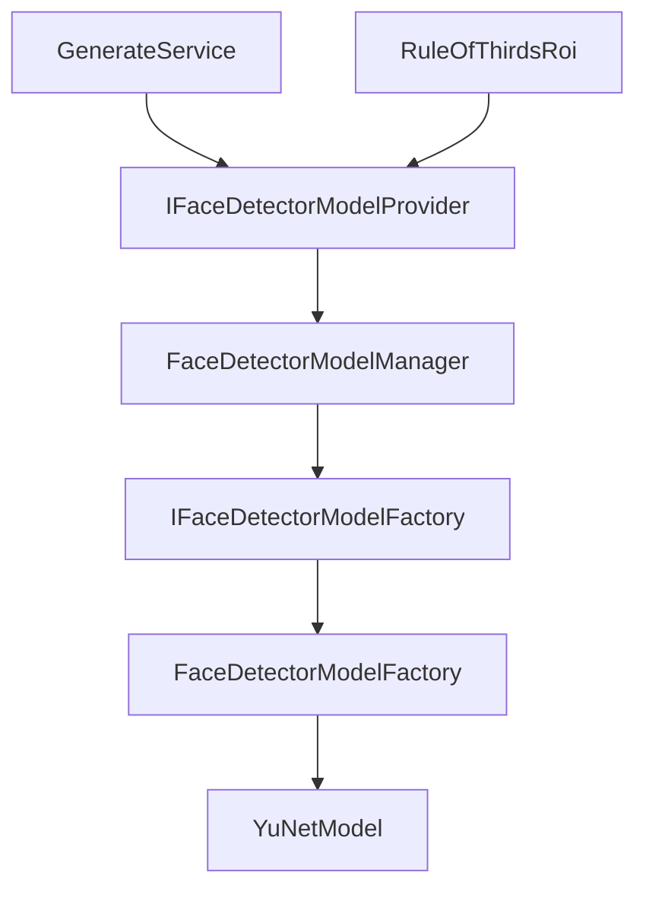

# Tài liệu Image Module

[🇬🇧 English Version](../en/image-module.md)

## Tổng Quan

Framework sử dụng **mô hình YuNet ONNX** với **OpenCvSharp4** để phát hiện khuôn mặt nhanh với các điểm mốc khuôn mặt. Hệ thống phát hiện khuôn mặt được thiết kế bằng mô hình provider để mở rộng tính năng và đơn giản hóa quản lý vòng đời mô hình.

## Kiến Trúc

### Mô Hình Provider



### Các Thành Phần

#### `IFaceDetectorModelProvider`

Giao diện để truy cập các mô hình phát hiện khuôn mặt:

```csharp
public interface IFaceDetectorModelProvider
{
    Task<FaceDetectorModel> GetCurrentModelAsync();
}
```

**Mục đích:**
- Trừu tượng hóa truy cập mô hình từ người tiêu dùng
- Ẩn quản lý vòng đời mô hình
- Cho phép dễ dàng mock để kiểm tra

#### `IFaceDetectorModelFactory`

Giao diện Factory để tạo các mô hình phát hiện khuôn mặt:

```csharp
public interface IFaceDetectorModelFactory
{
    FaceDetectorModel CreateModel(FaceDetectorModelKey modelKey);
}
```

#### `FaceDetectorModelManager`

Quản lý vòng đời mô hình và lựa chọn:

```csharp
public sealed class FaceDetectorModelManager : IFaceDetectorModelProvider
{
    private readonly IFaceDetectorModelFactory _modelFactory;
    private FaceDetectorModel? _currentModel;
    
    public FaceDetectorModelKey CurrentModelKey { get; private set; }
    
    public async Task<FaceDetectorModel> GetCurrentModelAsync()
    {
        // Tạo mô hình nếu không tồn tại
        if (_currentModel == null)
            _currentModel = _modelFactory.CreateModel(CurrentModelKey);
            
        // Đảm bảo khởi tạo
        if (!_currentModel.IsModelAvailable)
            await _currentModel.InitAsync();
            
        return _currentModel;
    }
}
```

**Trách nhiệm:**
- Tạo mô hình lười biếng qua factory
- Đảm bảo mô hình được khởi tạo trước khi sử dụng
- Quản lý chuyển đổi mô hình tại thời gian chạy
- Giải phóng các mô hình cũ đúng cách

#### `YuNetModel`

Triển khai phát hiện khuôn mặt sử dụng mô hình ONNX YuNet:

```csharp
public sealed class YuNetModel : FaceDetectorModel
{
    private FaceDetectorYN? _model;
    public Size InputSize { get; private set; } = new(320, 320);
    
    public override async Task<List<FaceInfo>> DetectAsync(Mat mat)
    {
        // 1. Tiền xử lý: resize + padding đến InputSize
        var preprocessInfo = ResizeAndPadMat(mat);
        
        // 2. Phát hiện khuôn mặt trên hình ảnh đã xử lý
        _model.Detect(preprocessInfo.ProcessedMat, result);
        
        // 3. Unmapping tọa độ về hình ảnh gốc
        var mappedRect = UnmapBoundingBox(rect, preprocessInfo);
        var mappedLandmarks = UnmapLandmark(point, preprocessInfo);
        
        return faces;
    }
}
```

**Tính năng:**
- Chuẩn hóa đầu vào (320×320 với bảo toàn tỷ lệ khung hình)
- Padding đen cho hình ảnh nhỏ hơn
- Unmapping tọa độ về không gian hình ảnh gốc
- 5 điểm mốc khuôn mặt (mắt, mũi, góc miệng)
- Tính toán điểm tin cậy

## Tiền Xử Lý Pipeline

### Resize và Padding

**Đầu vào:** Hình ảnh bất kỳ kích cỡ (ví dụ: 1920×1080)

**Quy trình:**
```
1. Tính tỷ lệ:
   scale = min(320/width, 320/height)
   
2. Resize với bảo toàn tỷ lệ:
   newWidth = width × scale
   newHeight = height × scale
   
3. Thêm padding đen để đạt 320×320:
   padLeft = (320 - newWidth) / 2
   padTop = (320 - newHeight) / 2
```

**Ví dụ:**
```
Đầu vào: Hình ảnh 600×400
Tỷ lệ: min(320/600, 320/400) = 0.533
Đã Resize: 320×213
Đã Padding: 320×320 (top: 53px, bottom: 54px padding)
```

### Unmapping Tọa Độ

**Unmapping về Gốc:**
```csharp
unmappedX = (detectedX - padLeft) / scale
unmappedY = (detectedY - padTop) / scale
```

## Tính Toán ROI (Vùng Quan Tâm)

### Các Loại ROI

#### 1. **CenterRoi** (Singleton)

Cắt trung tâm đơn giản:

```csharp
var roi = CenterRoi.Instance;
var rect = await roi.CalculateRoiAsync(mat, targetSize);
```

**Trường hợp sử dụng:** Cắt nhanh, dễ đoán

#### 2. **ProminentRoi** (Singleton)

Cắt dựa trên bản đồ Saliency:

```csharp
var roi = ProminentRoi.Instance;
var rect = await roi.CalculateRoiAsync(mat, targetSize);
```

**Thuật toán:**
1. Tính toán bản đồ saliency
2. Áp dụng Gaussian blur
3. Tìm điểm saliency cực đại
4. Cắt trung tâm quanh điểm đó

**Trường hợp sử dụng:** Tập trung tự động vào khu vực thú vị

#### 3. **RuleOfThirdsRoi** (Yêu Cầu Provider)

Cắt nhận biết khuôn mặt với quy tắc ba phần:

```csharp
var roi = new RuleOfThirdsRoi(faceDetectorProvider);
var rect = await roi.CalculateRoiAsync(mat, targetSize);
```

**Thuật toán:**
1. Phát hiện tất cả các khuôn mặt
2. Tính vị trí trung tâm mắt trung bình
3. Định vị tâm mắt tại giao điểm quy tắc ba phần
4. Fallback về trung tâm (50%, 50%) nếu không phát hiện khuôn mặt

**Trường hợp sử dụng:** Cắt chân dung chuyên nghiệp

### Mở Rộng ROI Calculator

```csharp
// Lấy máy tính với provider (bắt buộc cho RuleOfThirds)
var calculator = await roiType.GetCalculator(faceDetectorProvider);
var cropRect = await calculator.CalculateRoiAsync(mat, targetSize);

// RuleOfThirds không có provider ném ArgumentNullException
```

## Thao Tác Hình Ảnh

### ManipulatingService

```csharp
// Resize (tại chỗ)
ManipulatingService.Resize(ref mat, size, InterpolationFlags.Linear);

// Cắt (tại chỗ)
ManipulatingService.Crop(ref mat, rect);

// Kẹp vào viền
var clampedRect = ManipulatingService.ClampToBorder(rect, border);
var clampedPoint = ManipulatingService.ClampToBorder(point, border);

// Lấy kích cỡ khía cạnh tối đa
var maxSize = ManipulatingService.GetMaxAspectSize(original, target);
```

**Nguyên tắc:**
- Tất cả hoạt động sử dụng `OpenCvSharp.Size` (không phải `System.Drawing.Size`)
- Sửa đổi tại chỗ để cải thiện hiệu suất
- Phương thức tĩnh để dễ dàng tái sử dụng

## Luồng Xử Lý Hình Ảnh

```
ProcessImageBytesAsync(sourceBytes, targetSize, roiType)
  ├── 1. Tải hình ảnh → Mat
  ├── 2. Lấy máy tính ROI (có face detector nếu cần)
  │     └── RuleOfThirds gọi GetCurrentModelAsync()
  ├── 3. Tính hình chữ nhật ROI
  │     └── Phát hiện khuôn mặt + unmapping nếu RuleOfThirds
  ├── 4. Cắt đến ROI
  ├── 5. Resize đến mục tiêu
  └── 6. Chuyển đổi trở lại bytes
```

## Cách Sử Dụng

### Phát Hiện Khuôn Mặt Cơ Bản

```csharp
using SlideGenerator.Framework.Features.Image.Services;
using SlideGenerator.Framework.Features.Image.Contracts;
using ImageMagick;

public class MyService(IFaceDetectorModelProvider faceDetectorProvider)
{
    public async Task<List<FaceInfo>> DetectFaces(string imagePath)
    {
        // Tải hình ảnh sử dụng ConvertingService của Framework
        using var magickImage = new MagickImage(imagePath);
        var mat = ConvertingService.ConvertImageToMat(magickImage);
        if (mat == null || mat.Empty())
            return new List<FaceInfo>();
        
        try
        {
            var model = await faceDetectorProvider.GetCurrentModelAsync();
            var faces = await model.DetectAsync(mat);
            
            // Lọc theo độ tin cậy
            return faces.Where(f => f.Confidence >= 0.7f).ToList();
        }
        finally
        {
            mat.Dispose();
        }
    }
}
```

### ROI Với Phát Hiện Khuôn Mặt

```csharp
using SlideGenerator.Framework.Features.Image.Services;
using SlideGenerator.Framework.Features.Image.Models.Roi;
using SlideGenerator.Framework.Features.Image.Contracts;
using ImageMagick;
using OpenCvSharp;

public class ImageCropper
{
    public async Task<byte[]> CropWithFaces(
        string imagePath,
        Size targetSize,
        IFaceDetectorModelProvider provider)
    {
        // Tải hình ảnh sử dụng ConvertingService của Framework
        using var magickImage = new MagickImage(imagePath);
        var mat = ConvertingService.ConvertImageToMat(magickImage);
        if (mat == null || mat.Empty())
            return Array.Empty<byte>();
        
        try
        {
            // Lấy máy tính với hỗ trợ phát hiện khuôn mặt
            var calculator = await RoiType.RuleOfThirds
                .GetCalculator(provider);
            
            // Tính ROI (sẽ sử dụng phát hiện khuôn mặt)
            var cropRect = await calculator.CalculateRoiAsync(mat, targetSize);
            
            // Áp dụng cắt và resize sử dụng Framework
            ManipulatingService.Crop(ref mat, cropRect);
            ManipulatingService.Resize(ref mat, targetSize);
            
            // Chuyển đổi trở lại sử dụng Framework
            return ConvertingService.ConvertMatToImage(mat);
        }
        finally
        {
            mat.Dispose();
        }
    }
}

## Đăng Ký DI

```csharp
// Program.cs
services.AddSingleton<IFaceDetectorModelFactory, FaceDetectorModelFactory>();
services.AddSingleton<FaceDetectorModelManager>();
services.AddSingleton<IFaceDetectorModelProvider>(sp => 
    sp.GetRequiredService<FaceDetectorModelManager>());

// Các dịch vụ chỉ phụ thuộc vào IFaceDetectorModelProvider
services.AddSingleton<GenerateService>();
```

## Xem Xét Hiệu Suất

### Khởi Tạo Mô Hình
- Tải mô hình YuNet lười biếng trên gọi `GetCurrentModelAsync()` đầu tiên
- Khởi tạo mất ~50-100ms (chi phí một lần)
- Mô hình được giữ trong bộ nhớ cho các phát hiện tiếp theo

### Hiệu Suất Phát Hiện
- Suy luận 320×320: ~10-30ms (CPU)
- Tiền xử lý: ~5-10ms
- Unmapping: < 1ms
- Tổng cộng: ~15-40ms mỗi lần phát hiện

## Xử Lý Lỗi

```csharp
// Mô hình không được khởi tạo
try {
    var model = await provider.GetCurrentModelAsync();
} catch (InvalidOperationException ex) {
    // Mô hình không thể được khởi tạo
    // Kiểm tra: Tệp ONNX tồn tại, hỗ trợ backend OpenCV
}

// RuleOfThirds không có provider
try {
    var calc = await RoiType.RuleOfThirds.GetCalculator(null);
} catch (ArgumentNullException ex) {
    // "Face detector model provider is required..."
}

// Hình ảnh không hợp lệ
var faces = await model.DetectAsync(emptyMat);
// Trả về danh sách trống (không ném)
```

## Kiểm Tra

### Mock Provider

```csharp
public class FakeFaceDetectorProvider : IFaceDetectorModelProvider
{
    public FaceDetectorModel ModelToReturn { get; set; }
    
    public Task<FaceDetectorModel> GetCurrentModelAsync()
    {
        return Task.FromResult(ModelToReturn);
    }
}
```

## Hạn Chế

- ❌ Các mô hình riêng/bị hạn chế yêu cầu xác thực
- ❌ Liên kết chia sẻ hết hạn sẽ thất bại
- ✅ Các chia sẻ công khai từ các nền tảng được hỗ trợ hoạt động ngay lập tức
- ✅ Không cần khóa API hoặc mã thông báo xác thực

## An Toàn Luồng

- `CloudUrlResolver` là an toàn luồng
- Có thể được gọi từ nhiều luồng đồng thời

---

Tiếp theo: [Tổng Quan](overview.md) | [Cloud Module](cloud-module.md)

