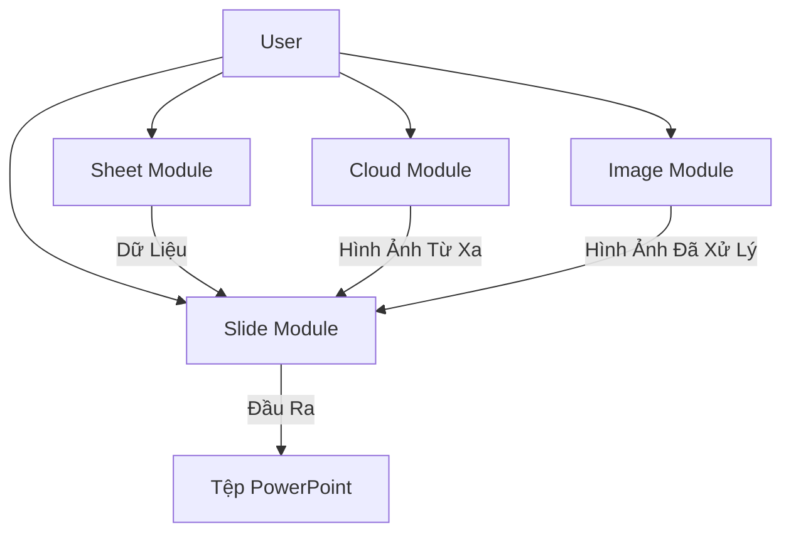

# Tổng Quan Framework

[🇬🇧 English Version](../en/overview.md)

## Mục Đích

`SlideGenerator.Framework` là một thư viện .NET hiệu suất cao được thiết kế để trừu tượng hóa các phức tạp của việc tạo bản trình bày PowerPoint từ dữ liệu có cấu trúc. Nó đóng vai trò là công cụ xử lý cốt lõi cho ứng dụng SlideGenerator, xử lý mọi thứ từ phân tích tệp Excel đến cắt hình ảnh thông minh và kết xuất trang trình bày.

Mặc dù Backend xử lý điều phối công việc và đồng thời, Framework này cung cấp các công cụ nguyên tử để sửa đổi tệp.

## Kiến Trúc

Framework được tổ chức thành bốn mô-đun độc lập nhưng bổ sung cho nhau:



## Các Mô-đun

### 1. ☁️ Cloud (`SlideGenerator.Framework.Cloud`)
Xử lý việc giải quyết các liên kết chia sẻ (Google Drive, OneDrive, Google Photos) thành các luồng tải trực tiếp. Điều này cho phép trình tạo kéo hình ảnh trực tiếp từ lưu trữ đám mây mà không cần tải xuống thủ công.

**Các Thành Phần Chính:**
- `CloudUrlResolver`: Tiện ích tĩnh để giải quyết các liên kết chia sẻ đám mây

**Tài Liệu:** [Hướng Dẫn Cloud Module](cloud-module.md)

### 2. 📊 Sheet (`SlideGenerator.Framework.Sheet`)
Một trình bao bọc nhẹ nhàng quanh `OpenXml` để đọc các nguồn dữ liệu.
- **Workbook:** Đại diện cho toàn bộ tệp Excel.
- **Worksheet:** Cung cấp truy cập từng hàng vào dữ liệu dưới dạng từ điển chung (`Dictionary<string, object>`).

**Các Thành Phần Chính:**
- `Workbook`: Tải và quản lý các tệp Excel
- `Worksheet`: Truy cập dữ liệu hàng với chuyển đổi kiểu

**Tài Liệu:** [Hướng Dẫn Sheet Module](sheet-module.md)

### 3. 🖼️ Slide (`SlideGenerator.Framework.Slide`)
Logistic thao tác cốt lõi.
- **TemplatePresentation:** Tải một mẫu `.pptx` (chặt chẽ 1 trang trình bày).
- **WorkingPresentation:** Quản lý tệp đầu ra, sao chép trang trình bày và lưu các thay đổi.
- **Replacers:** Trợ giúp tĩnh để trao đổi văn bản (`{{Khóa}}`) và hình ảnh (theo ID Hình Dạng).

**Các Thành Phần Chính:**
- `TemplatePresentation`: Tải và khám phá các hình dạng mẫu
- `WorkingPresentation`: Sao chép trang trình bày và lưu các thay đổi
- `TextReplacer`: Thay thế giữ chỗ `{{Khóa}}`
- `ImageReplacer`: Thay thế hình ảnh theo ID hình dạng
- `ShapeService`: Tìm hình dạng trong trang trình bày

**Tài Liệu:** [Hướng Dẫn Slide Module](slide-module.md)

### 4. 🧠 Image (`SlideGenerator.Framework.Image`)
Tận dụng **OpenCvSharp4** (trình bao bọc OpenCV) để xử lý hình ảnh nâng cao.
- **Phát Hiện Khuôn Mặt:** Mô hình ONNX YuNet với 5 điểm mốc khuôn mặt
- **Phát Hiện ROI:** Lựa chọn vùng thông minh (Trung Tâm, Nổi Bật, Quy Tắc Ba Phần)
- **Thao Tác Hình Ảnh:** Resize, cắt, mapping tọa độ
- **Mô Hình Provider:** Tiêm phụ thuộc cho quản lý mô hình

**Các Thành Phần Chính:**
- `IFaceDetectorModelProvider`: Truy cập các mô hình phát hiện khuôn mặt
- `FaceDetectorModelManager`: Quản lý vòng đời mô hình
- `RoiCalculator`: Các thuật toán ROI khác nhau
- `ManipulatingService`: Tiện ích thao tác hình ảnh

**Tài Liệu:** [Hướng Dẫn Image Module](image-module.md)

## Hướng Dẫn Tài Liệu

| Chủ Đề | Liên Kết |
|--------|---------|
| **Cloud Module** | [cloud-module.md](cloud-module.md) - Giải quyết các liên kết chia sẻ đám mây |
| **Sheet Module** | [sheet-module.md](sheet-module.md) - Đọc dữ liệu Excel |
| **Slide Module** | [slide-module.md](slide-module.md) - Thao tác bản trình bày |
| **Image Module** | [image-module.md](image-module.md) - Phát hiện khuôn mặt & ROI |
| **Tham Chiếu API Đầy Đủ** | [README.md](../../README.md) - Hướng dẫn bắt đầu nhanh |

## Thực Hành Tốt Nhất

### Quản Lý Tài Nguyên (`IDisposable`)
Cả `Workbook` và `Presentation` đều giữ các luồng tệp mở để đảm bảo hiệu suất.
- **Luôn** bao bọc các đối tượng này trong các câu lệnh `using` hoặc gọi `.Dispose()` rõ ràng.
- Không giải phóng có thể dẫn đến khóa tệp, ngăn chặn các lần đọc/ghi tiếp theo hoặc xóa các tệp tạm thời.

### An Toàn Luồng
- Các thành phần Framework được thiết kế để sử dụng trong một phạm vi duy nhất (ví dụ: một công việc duy nhất).
- **Đừng chia sẻ** các instance `Workbook` hoặc `Presentation` trên các luồng đồng thời.
- Trợ giúp tĩnh (như `TextReplacer`, `CloudUrlResolver`) là an toàn luồng.

### Tiêm Phụ Thuộc
Mô-đun Hình Ảnh sử dụng mô hình provider để linh hoạt:
```csharp
// Thiết lập DI
services.AddSingleton<IFaceDetectorModelFactory, FaceDetectorModelFactory>();
services.AddSingleton<FaceDetectorModelManager>();
services.AddSingleton<IFaceDetectorModelProvider>(sp => 
    sp.GetRequiredService<FaceDetectorModelManager>());

// Tiêm trong các dịch vụ
public class MyService(IFaceDetectorModelProvider provider)
{
    var model = await provider.GetCurrentModelAsync();
}
```

## Stack Công Nghệ

| Thành Phần | Công Nghệ | Mục Đích |
|-----------|-----------|---------|
| **Xử Lý Hình Ảnh** | OpenCvSharp4 | Các hoạt động thị giác máy tính |
| **Phát Hiện Khuôn Mặt** | Mô Hình ONNX YuNet | Phát hiện khuôn mặt nhanh với điểm mốc |
| **PowerPoint** | DocumentFormat.OpenXml | Thao tác bản trình bày |
| **Excel** | ClosedXML | Đọc bảng tính |
| **Chuyển Đổi Hình Ảnh** | ImageMagick (Magick.NET) | Chuyển đổi định dạng |

## Bắt Đầu Nhanh

### 1. Đọc Dữ Liệu Excel
```csharp
using var workbook = new Workbook("data.xlsx");
var sheet = workbook.GetWorksheet("Nhân Viên");
foreach (var row in sheet.GetAllRows())
{
    Console.WriteLine($"{row["Tên"]}: {row["Chức Vụ"]}");
}
```

### 2. Thao Tác Bản Trình Bày
```csharp
using var template = new TemplatePresentation("template.pptx");
using var working = template.SaveAs("output.pptx");
var slidePart = working.CopySlide(template.MainSlideRelationshipId);
await TextReplacer.ReplaceAsync(slidePart, new() { ["Tên"] = "Nguyễn Văn A" });
working.Save();
```

### 3. Xử Lý Hình Ảnh Với Phát Hiện Khuôn Mặt
```csharp
var provider = services.GetRequiredService<IFaceDetectorModelProvider>();
var model = await provider.GetCurrentModelAsync();
var mat = Cv2.ImRead("photo.jpg");
var faces = await model.DetectAsync(mat);
```

### 4. Giải Quyết Liên Kết Đám Mây
```csharp
var directUrl = await CloudUrlResolver.ResolveLinkAsync(
    "https://drive.google.com/file/d/1ABC123/view");
var bytes = await new HttpClient().GetByteArrayAsync(directUrl);
```

---

**Tài Liệu Đầy Đủ:** Xem các hướng dẫn mô-đun ở trên để tham chiếu API đầy đủ và ví dụ.

**GitHub:** [SlideGenerator.Framework](https://github.com/thnhmai06/SlideGenerator.Framework)

### Quản lý tài nguyên (`IDisposable`)
Cả `Workbook` và `Presentation` đều giữ các luồng file (file streams) mở để đảm bảo hiệu năng.
- **Luôn luôn** bọc các đối tượng này trong khối `using` hoặc gọi `.Dispose()` một cách tường minh.
- Không giải phóng (dispose) có thể dẫn đến việc khóa file (file locks), ngăn cản các thao tác đọc/ghi hoặc xóa file tạm sau đó.

### An toàn luồng (Thread Safety)
- Các thành phần của Framework được thiết kế để sử dụng trong một phạm vi đơn lẻ (ví dụ: một Job đơn lẻ).
- **Không chia sẻ** các instance của `Workbook` hoặc `Presentation` giữa các luồng đồng thời.
- Các hàm hỗ trợ tĩnh (như `TextReplacer`, `CloudUrlResolver`) là thread-safe.

Tiếp theo: [Hướng dẫn sử dụng](usage.md)
