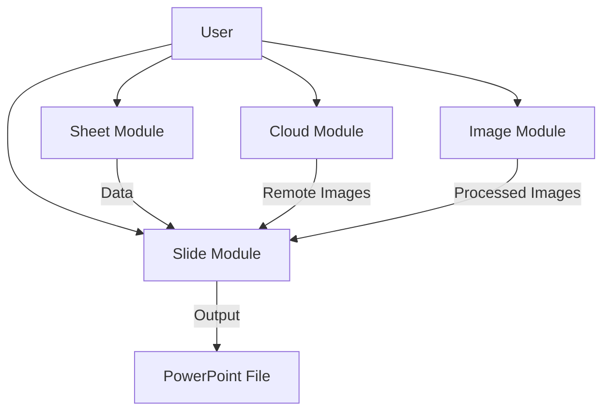

# Framework Overview

[🇻🇳 Vietnamese Version](../vi/overview.md)

## Purpose

`SlideGenerator.Framework` is a high-performance .NET library designed to abstract the complexities of generating PowerPoint presentations from structured data. It serves as the core processing engine for the SlideGenerator application, handling everything from parsing Excel files to intelligent image cropping and slide rendering.

While the Backend handles job orchestration and concurrency, this Framework provides the atomic tools to modify files.

## Architecture

The framework is organized into four independent but complementary modules:

## Modules

### 1. ☁️ Cloud (`SlideGenerator.Framework.Cloud`)
Handles the resolution of shareable links (Google Drive, OneDrive, Google Photos) into direct download streams. This allows the generator to pull images directly from cloud storage without manual downloading.

### 2. 📊 Sheet (`SlideGenerator.Framework.Sheet`)
A lightweight wrapper around `OpenXml` for reading data sources.
- **Workbook:** Represents the entire Excel file.
- **Worksheet:** Provides row-by-row access to data as generic dictionaries (`Dictionary<string, object>`).

### 3. 🖼️ Slide (`SlideGenerator.Framework.Slide`)
The core manipulation logic.
- **TemplatePresentation:** Loads a `.pptx` template (strictly 1 slide).
- **WorkingPresentation:** Manages the output file, cloning slides, and saving changes.
- **Replacers:** Static helpers for swapping text (`{{Key}}`) and images (by Shape ID).

### 4. 🧠 Image (`SlideGenerator.Framework.Image`)
Leverages **EmguCV** (OpenCV wrapper) for advanced image processing.
- **ROI Detection:** Uses AI (YuNet) to detect faces or Saliency maps to detect interesting regions.
- **Cropping:** Smart cropping (Center, Fill, Fit) based on the detected ROI.

## Best Practices

### Resource Management (`IDisposable`)
Both `Workbook` and `Presentation` models hold open file streams to ensure performance.
- **Always** wrap these objects in `using` statements or call `.Dispose()` explicitly.
- Failure to dispose may result in file locks, preventing subsequent reads/writes or deletion of temporary files.

### Thread Safety
- The Framework components are designed to be used within a single scope (e.g., a single Job).
- **Do not share** `Workbook` or `Presentation` instances across concurrent threads.
- Static helpers (like `TextReplacer`, `CloudUrlResolver`) are thread-safe.

Next: [Usage Guide](usage.md)
