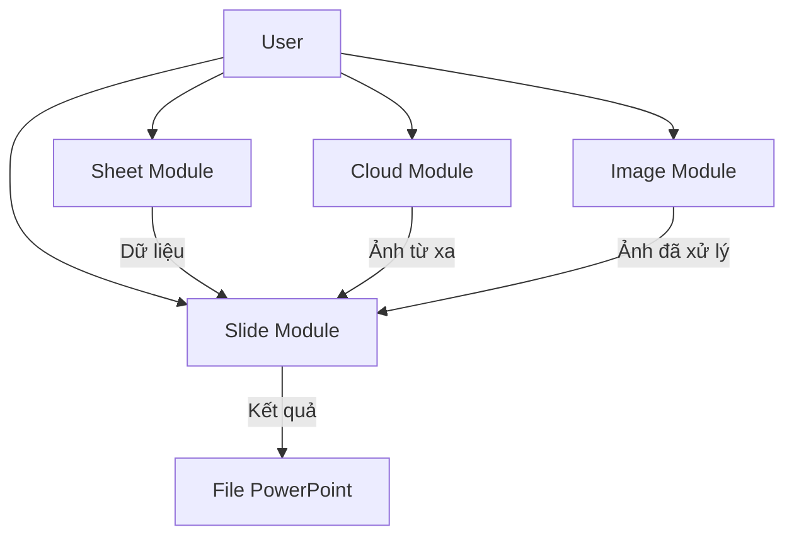

# Tổng quan Framework

[🇺🇸 English Version](../en/overview.md)

## Mục đích

`SlideGenerator.Framework` là một thư viện .NET hiệu năng cao được thiết kế để đơn giản hóa sự phức tạp khi tạo file PowerPoint từ dữ liệu có cấu trúc. Nó đóng vai trò là động cơ xử lý cốt lõi cho ứng dụng SlideGenerator, đảm nhận mọi thứ từ việc phân tích file Excel đến cắt ảnh thông minh và render slide.

Trong khi Backend chịu trách nhiệm điều phối công việc (Job orchestration) và xử lý đồng thời (Concurrency), Framework cung cấp các công cụ thiết yếu để thao tác trực tiếp với file.

## Kiến trúc

Framework được tổ chức thành 4 module độc lập nhưng bổ trợ cho nhau:

## Các Module

### 1. ☁️ Cloud (`SlideGenerator.Framework.Cloud`)
Xử lý việc phân giải các đường dẫn chia sẻ (shareable links) từ Google Drive, OneDrive, Google Photos thành các luồng tải xuống trực tiếp (direct streams). Điều này cho phép ứng dụng lấy ảnh trực tiếp từ đám mây mà không cần tải thủ công.

### 2. 📊 Sheet (`SlideGenerator.Framework.Sheet`)
Một lớp bao bọc nhẹ (wrapper) quanh `OpenXml` để đọc nguồn dữ liệu.
- **Workbook:** Đại diện cho toàn bộ file Excel.
- **Worksheet:** Cung cấp quyền truy cập từng dòng dữ liệu dưới dạng dictionary (`Dictionary<string, object>`).

### 3. 🖼️ Slide (`SlideGenerator.Framework.Slide`)
Logic thao tác cốt lõi.
- **TemplatePresentation:** Tải file mẫu `.pptx` (yêu cầu nghiêm ngặt: chỉ chứa 1 slide).
- **WorkingPresentation:** Quản lý file đầu ra, sao chép slide và lưu thay đổi.
- **Replacers:** Các hàm hỗ trợ tĩnh (static helpers) để thay thế văn bản (`{{Key}}`) và hình ảnh (theo Shape ID).

### 4. 🧠 Image (`SlideGenerator.Framework.Image`)
Sử dụng **EmguCV** (OpenCV wrapper) cho các tác vụ xử lý ảnh nâng cao.
- **ROI Detection:** Sử dụng AI (YuNet) để phát hiện khuôn mặt hoặc bản đồ Saliency để tìm vùng quan trọng.
- **Cropping:** Cắt ảnh thông minh (Center, Fill, Fit) dựa trên vùng ROI đã phát hiện.

## Best Practices (Thực tiễn tốt nhất)

### Quản lý tài nguyên (`IDisposable`)
Cả `Workbook` và `Presentation` đều giữ các luồng file (file streams) mở để đảm bảo hiệu năng.
- **Luôn luôn** bọc các đối tượng này trong khối `using` hoặc gọi `.Dispose()` một cách tường minh.
- Không giải phóng (dispose) có thể dẫn đến việc khóa file (file locks), ngăn cản các thao tác đọc/ghi hoặc xóa file tạm sau đó.

### An toàn luồng (Thread Safety)
- Các thành phần của Framework được thiết kế để sử dụng trong một phạm vi đơn lẻ (ví dụ: một Job đơn lẻ).
- **Không chia sẻ** các instance của `Workbook` hoặc `Presentation` giữa các luồng đồng thời.
- Các hàm hỗ trợ tĩnh (như `TextReplacer`, `CloudUrlResolver`) là thread-safe.

Tiếp theo: [Hướng dẫn sử dụng](usage.md)
